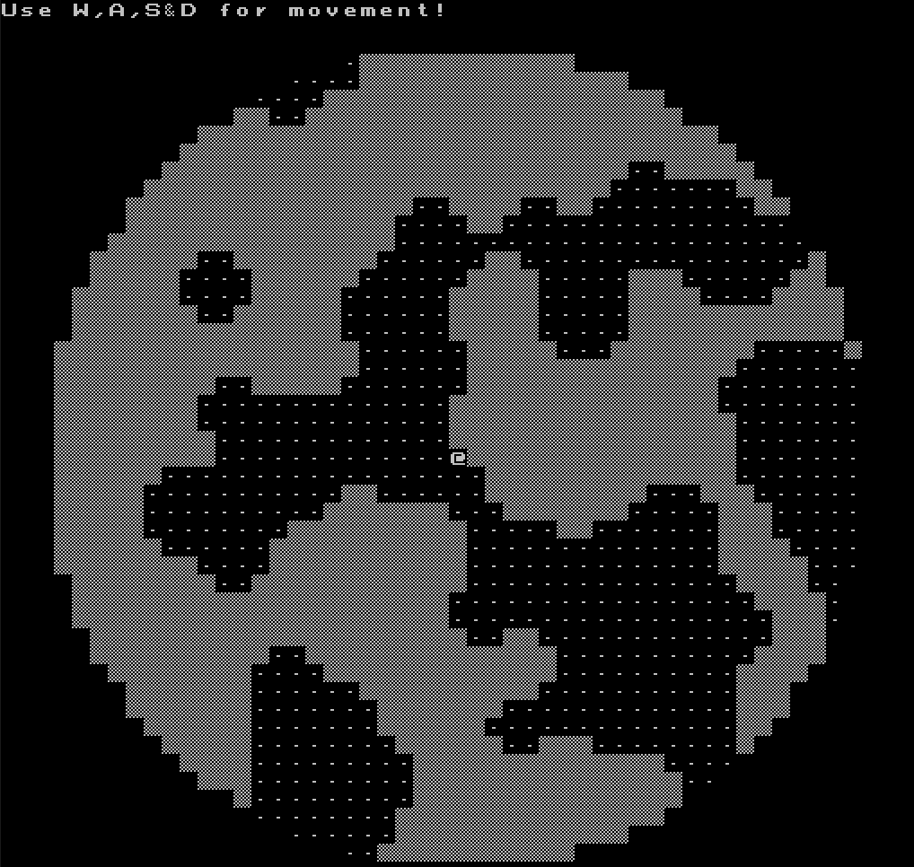
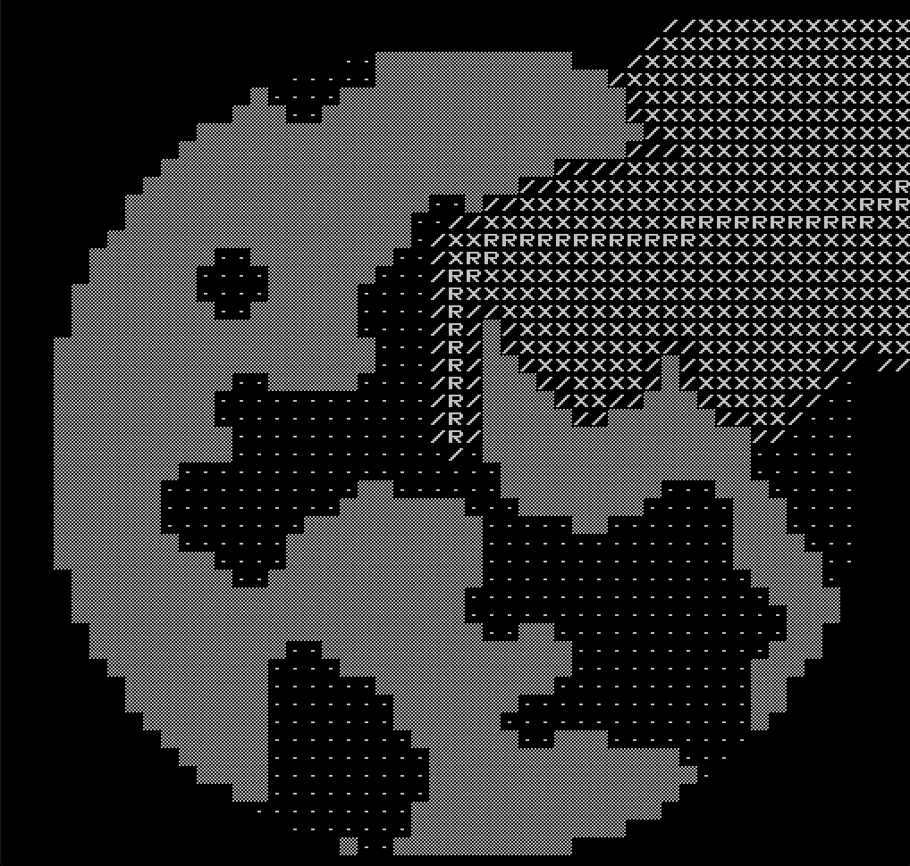

# Mitä sovelluksessa on testattu ja miten testit ovat toistettavissa

Sovelluksessa on luotu walking skeleton jonka jälkeen on testattu erilaisia luolaston luomistapoja. Tästä enemmän kappaleessa 'Ohjelman toiminnan empiirisen testauksen tulokset'.

Testiautomaatiossa on käytetty JUnitia ja Mockitoa jotta jokaisen luokan toiminta voidaan mahdolisimman pitkälle testata käyttämättä muista luokista luotuja olioita. Tästä on muutamassa kohdassa tosin joustettu sillä harjoitustyötä ei ole nähty ensisijaisesti sovellusrakenteen harjoitustyönä.

Reitinhakualgoritmia on testattu ensin tulostamalla käyttöliittymään tietoa reitinhaun etenemisestä reitinhakualgoritmin debuggauksen yhteydessä. Myöhemmässä vaiheessa reintinhaun heuristiikan ja keon kehittämisen tueksi on tulostettu reitinhaun käyttäytymistä konsoliin. Tämän tuloksista enemmän kappaleessa 'Reitinhaun algoritmin toiminnan testaus'.

Algoritmien toimintaa on testattu kahdella tavasalla. Vakioidusti, antamalla satunnaislukugeneraattoreille vakioitu seed sekä sattumanvaraisesti useammalla otoksella. Näin on haluttu varmistaa että vakioitu tilanne ei vahingossa ole poikkeistapaus.

# Ohjelman toiminnan empiirisen testauksen tulokset

Empiirinen testaus kohdistui ensiksi maailman luomiseen. Lähtökohdaksi otettiin soluautomaatio [roguelike tutorial, Trystan](http://trystans.blogspot.com) pohjasta jotta walking skeleton saatiin nopeammin valmiiksi ja päästin testaamaan hirviöiden reitinhakua ja kaivautumista. 

Luolaston luomiseen kokeiltiin myös random walk algoritmia joka lisäsi huoneita mutta tämä huomattiin tylsäksi pelata. Myös soluautomaation, huoneiden luomisen ja random walk -algoritmien yhdistelmiä kokeiltiin mutta parhaimman lopputuloksen antoi soluautomaatio joten päädyttiin jatkokehittämään aiemmin valittua pohjaa. Nämä on poistettu koodista mutta niihin pääsee tutustumaan esim. [tästä vanhasta commitista](https://github.com/juhoaj/tiralabra-tractus/tree/f096ce4f0dfb0fa937996bdffa01ea6a542780a4).

# Reitinhaun algoritmin toiminnan testaus

A* algoritmi tehtiin ensiksi siten että sen heuristiikka oli alku- ja loppupisteen välinen välimatka. Toimintanopeuden testaamisen alettua havaittiin se hyvin tehottomaksi. Alla testitulokset (pinona PriorityQue).

Kun pelialueen koko on 51x51 ja kartta on vakioitu saatiin seuraava (toistettavat) mittaustulokset:

| Heuristiikka       | Nodeja käyty läpi    |  Reitin pituus    |
|--------------------|---------------------:|------------------:|
| välimatka * 1      | 614                  | 57                |
| välimatka * 1.25   | 528                  | 57                |
| välimatka * 1.5    | 347                  | 57                |
| välimatka * 1.75   | 236                  | 57                |
| välimatka * 2      | 198                  | 57                |
| välimatka * 3      | 82                   | 57                |
| välimatka * 4      | 70                   | 57                |
| välimatka * 5      | 60                   | 57                |
| välimatka * 6      | 60                   | 57                |
| välimatka ^2       | 62                   | 57                |          
| välimatka ^3       | 61                   | 57                |
| välimatka ^4       | 61                   | 57                |

Kun pelialueen koko on 500x500 ja kartta on vakioitu saatiin seuraava (toistettavat) mittaustulokset:

| Heuristiikka       | Nodeja käsitelty     |  Reitin pituus    |
|--------------------|---------------------:|------------------:|
| välimatka *1       | 20821                | 259               |
| välimatka *2       | 368                  | 241               |
| välimatka *3       | 251                  | 241               |
| välimatka *4       | 248                  | 241               |
| välimatka ^2       | 243                  | 241               | 
| välimatka ^3       | 243                  | 241               |   
| välimatka ^4       | 243                  | 241               |

Kun pelialueen koko on 1000x1000 ja kartta on vakioitu saatiin seuraava (toistettavat) mittaustulokset:

| Heuristiikka       | Nodeja käsitelty     |  Reitin pituus    |
|--------------------|---------------------:|------------------:|
| välimatka *1       | 151666               | 687               |
| välimatka *2       | 1579                 | 671               |
| välimatka *3       | 796                  | 669               |
| välimatka *4       | 774                  | 669               |
| välimatka ^2       | 756                  | 669               |
| välimatka ^3       | 756                  | 669               |
| välimatka ^4       | ∞                    | ?                 |

Kun pelialueen koko on 2001x2001 ja kartta on vakioitu saatiin seuraava (toistettavat) mittaustulokset:

| Heuristiikka       | Nodeja käsitelty     |  Reitin pituus    |
|--------------------|---------------------:|------------------:|
| välimatka *1       | 437619               | 1130              |
| välimatka *2       | 4009                 | 1128              |
| välimatka *3       | 1540                 | 1122              |
| välimatka *4       | 1308                 | 1122              |
| välimatka ^2       | 1232                 | 1122              |
| välimatka ^3       | 1232                 | 1122              |
| välimatka ^4       | ∞                    | ?                 |

Kun pelialueen koko on 4001x4001 ja kartta on vakioitu saatiin seuraava (toistettavat) mittaustulokset:

| Heuristiikka       | Nodeja käsitelty     |  Reitin pituus    |
|--------------------|---------------------:|------------------:|
| välimatka *1       | 1619360              | 2086              |
| välimatka *2       | 6183                 | 2086              |
| välimatka *3       | 2706                 | 2082              |
| välimatka *4       | 2508                 | 2082              |
| välimatka ^2       | 2325                 | 2082              |
| välimatka ^3       | ∞                    | ?                 |
| välimatka ^4       | ∞                    | ?                 |

Näin ollen A* algoritmin heuristiikaksi valittiin välimatka ^2.

Alkutilanne:

Reitinhaku pelaajan liikuttua vasemmalle, heuristiikka: välimatka * 1

Reitinhaku pelaajan liikuttua vasemmalle, heuristiikka: välimatka ^ 2

# Reitinhaun käyttäytymisen testaus keon valinnan tueksi

Kun A* heuristiikkana on matka^2 ja kartta vakioitu tehdään kekoon kymmentä add -kutsua kohden ~neljä poll ja isEmpty -kutsua:

| Maailman koko       | Reitin pituus     | Nodeja lisätty pinoon    | Pinon maksimikoko    | Pinon koko reitinhaun lopussa  | pituus / lisätty    | lisätty / maksimi   |
|---------------------|------------------:|-------------------------:|---------------------:|-------------------------------:|--------------------:|--------------------:|
| 51x51               | 57                | 150                      | 89                   | 88                             | 0,38	               | 0,59                |
| 500x500             | 241               | 660                      | 418                  | 417                            | 0,37	               | 0,63                | 
| 1000x1000           | 669               | 1848                     | 1093                 | 1092                           | 0,36	               | 0,59                |
| 2001x2001           | 1122              | 3149                     | 1918                 | 1917                           | 0,36	               | 0,61                |
| 4001x4001           | 2082              | 5814                     | 3490                 | 3489                           | 0,36	               | 0,60                |

Jos maailman koko on 500x500 ja karttaa ei ole vakioitu havaitaan myös sama suhde.

| Reitin pituus     | Nodeja lisätty pinoon    | Pinon maksimikoko    | Pinon koko reitinhaun lopussa  | pituus / lisätty    | lisätty / maksimi   |
|------------------:|-------------------------:|---------------------:|-------------------------------:|--------------------:|--------------------:|
| 233	            | 636	                   | 378	              |377	                           |0,37                 |0,59                 |
| 209	            | 548	                   | 319	              |318	                           |0,38                 |0,58                 |
| 386	            | 1055	                   | 619	              |618	                           |0,37                 |0,59                 |
| 293	            | 810	                   | 473	              |472                             |0,36                 |0,58                 |

Näin ollen valitun tietorakenteessa on tärkeätä isEmpty kutsun tehokkuuden lisäksi ensisijaisesti insert ja tämän jälkeen poll -kyselyn tehokkuus.

Lähdeaineistosta määrittelyvaiheessa luettu Fibonacci-kekojen sopivuudesta tälläiseen tilanteeseen on validi sillä sen insert -metodin aikavaativuus on vain O(1) siinä missä AVL binääripuulla se on O(log n). Lisäksi A* algoritmissa kekoon lisätään pääsääntöisesti keossa olevia nodeja pienempiä nodeja. Tällöin AVL binääripuulla on jatkuvasti tasapainotettava kekoa ja oltaisiin todennäköisesti lähellä hitainta mahdollista insert-metodin suorituskykyä.

Fibonacci-keko on kuitenkin verrattain vaikea toteuttaa. Myöhemmin kerätystä lähdeaineistosta tutuksi tullut pairing heap on käytännössä yhtä validi. Molempien kekojen insert -metodin aikavaativuus on O(1). Lisäksi pairing Heap -keon delete-metodin käytännön suorituskyky on lähteiden mukaan käytännössä samaa luokkaa kuin Fibonacci-keon O(1). Myös isEmpty -kysely on molemmissa O(1).

# Keon testaus

Kekoa toteutettiin erityisesti delete-min metodin kohdalla naivimmin kuin löydetyissä java-implementoinneissa, joita ei haluttu orjallisesti kopioida. Reitinhaun käyttäytymisen tastauksen pojalta on pääteltävissä että puu on leveyssuunnassa varsin kapea ja pystysuunnassa korkea. Näin ollen delete-min -metodilla oletetaan olevan verrattain vähän työtä. 

Ensiksi kokeiltiin reitinhakua ja varmistettiin että reittien pituudet vakioidulla kartanluomisella pysyvät samana.

| Maailman koko      | PriorityQue     |  PairingHeap    |
|--------------------|---------------------:|------------------:|
| 51x51              | 57                 | 57              |
| 500x500            | 241             | 241
| 1000x1000          | 669            | 669              |
| 2001x2001          | 1122           | 1122                 |
| 4001x4001          | 2082             | 2082                 |

Voidaan todeta että PairingHeap ei vaikuta reitinhakualgoritmin toimintaan negatiivisesti.

