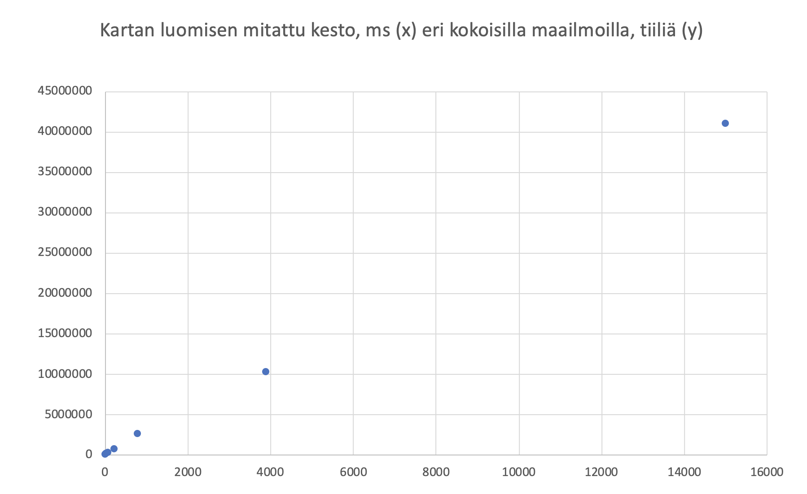
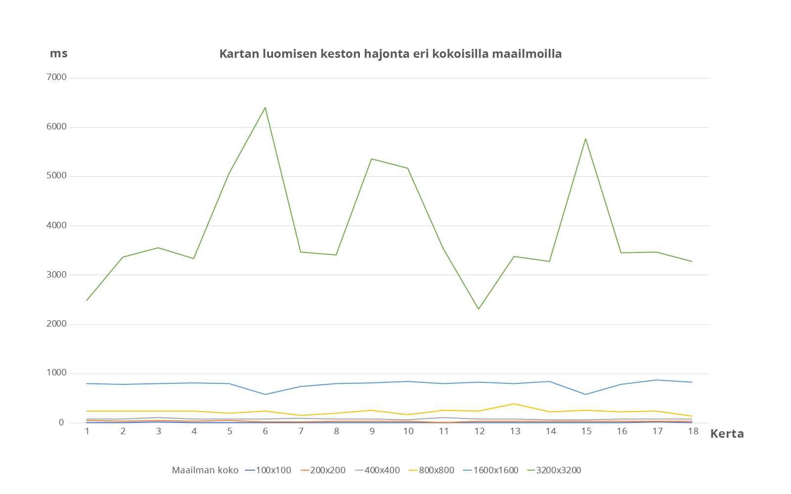

# Ohjelman yleisrakenne


 Näistä merkittävin on [AsciiPanel](https://github.com/trystan/AsciiPanel) jota käytetään pelin piirtämiseen.


# Saavutetut aika- ja tilavaativuudet 

## Maailman luominen

Maailman luomisen algoritmi on yksinkertaistetusti:

````
satunnainen häly
soluautomaatio(m)

funktio satunnainen häly()
    for (x<kartan leveys;x+1)
        for (y<kartan leveysys;y+1)
            kartta[x][y]=random(lattia,seinä)

funktio soluautomaatio(m)
    for (i<m;i+1)
        for (x<kartan leveys;x+1)
            for (y<kartan leveysys;y+1)
                käy läpi 8 ympäröivää ruutua ja laske lattiat sekä seinät
                if seinät > lattiat   
                    kartta[x][y]=seinä
                else
                    kartta[x][y]=lattia    
````

Pseudokoodista voidaan päätellä että kartan luomisen algoritmin tehokkuus on `m` * `n` jossa m on smooth -soluautomaatiometodin toistokerrat ja `n` kartan tiilien määrä. Satunnaisen hälyn vaativuus on vain `n` joten se lienee järkevintä jättää algoritmin tehokkuudessa mainitsematta. Koska `m` ei käytännössä nouse yli kymmenen lienee järkevintä sievistää kartan luomisen algoritmin tehokkuus muotoon O(n) jossa `n` on kartan tiilien määrä.

Päätelmää tukee että maailman luomisen mitattu esto on suoraan suhteessa kartain tiilien määrään 18 mittauksen keskiarvoilla laskettuna. 



Lisäksi maailman luomisen keston hajonta pysyttelee +-50% prosentin luokassa.




## Reitinhaku

Kun A* heuristiikkana on matka^2 ja kartta vakioitu saadaan seuraavat mittaustulokset. Vakioidun ja sattumanvaraisesti luodun maailman mittaustulosten vastaavuus kuvattu [Testaus](https://github.com/juhoaj/tiralabra-tractus/blob/master/documentation/testaus.md)-dokumentissa kappaleessa 'Reitinhaun käyttäytymisen testaus keon valinnan tueksi'.

| Maailman koko       | Reitin pituus     | Nodeja lisätty pinoon    | Pinon maksimikoko    | Nodeja käsitelty | pituus / lisätty    | lisätty / maksimi   |
|---------------------|------------------:|-------------------------:|---------------------:|-----------------:|--------------------:|--------------------:|
| 51x51               | 57                | 150                      | 89                   | 62                             | 0,38	               | 0,59                |
| 500x500             | 241               | 660                      | 418                  | 243                            | 0,37	               | 0,63                | 
| 1000x1000           | 669               | 1848                     | 1093                 | 756                           | 0,36	               | 0,59                |
| 2001x2001           | 1122              | 3149                     | 1918                 | 1232                           | 0,36	               | 0,61                |
| 4001x4001           | 2082              | 5814                     | 3490                 | 2325                           | 0,36	               | 0,60                |


## Reitinhaun käyttämä keko


# Työn mahdolliset puutteet ja parannusehdotukset

Työn lähtökohtana on ollut "kuinka iso luolasto voidaan ja kuinka monta hirviötä siinä voi olla ennenkuin algoritmit kyykkäävät". 

Näin ollen maailman luomisessa voitaisiin käyttää myös proseduraalista maailman luomista jossa karttaa generoidaan pelaajan liikkeiden mukaan. Lisäksi hirviöt voisivat kauempana pelaajasta ollessaan käyttää vielä nopeampaa algoritmia, esim. vain kulkeutua pelaajan suuntaan. 

Field of view -algoritmia olisi myös ollut kiva harjoitella työssä mutta tämä rajattiin pois ajankäytön järkevyyden nimissä.

Jos harjoitustyötä tarkastellaan pelinä niin suuri osa tyypillisistä roguelike -elementeistä toki loistaa puuttumisellaan. 


# Lähteet
* [Nicholas Swift, Easy A* (star) Pathfinding](https://medium.com/@nicholas.w.swift/easy-a-star-pathfinding-7e6689c7f7b2)

* [Jakob Jenkov, Java Generics - Implementing the Iterable Interface](http://tutorials.jenkov.com/java-generics/implementing-iterable.html)

* [Wikipedia, Generics in Java](https://en.wikipedia.org/wiki/Generics_in_Java)

* [From Amit’s Thoughts on Pathfinding: Implementation notes](http://theory.stanford.edu/~amitp/GameProgramming/ImplementationNotes.html)

* [Karleigh Moore, Pairing Heap](https://brilliant.org/wiki/pairing-heap)

* [Wikipedia, Pairing Heap](https://en.wikipedia.org/wiki/Pairing_heap)

