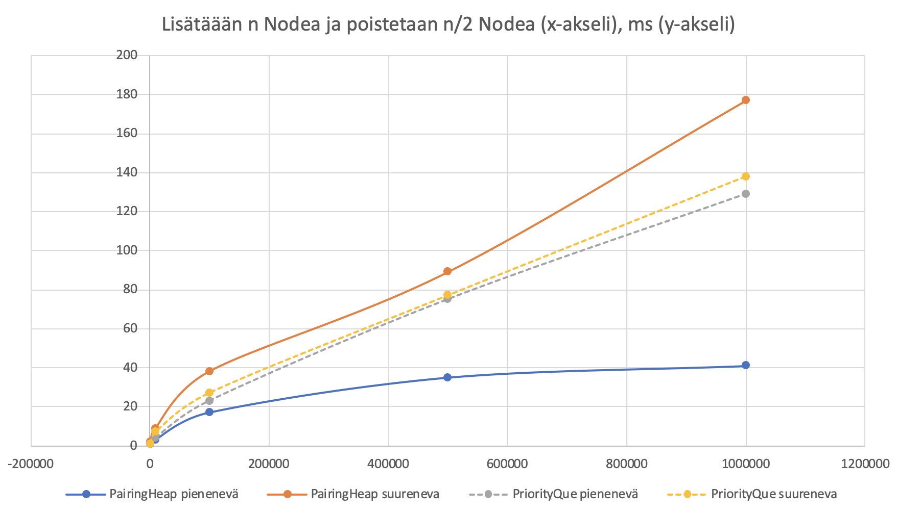
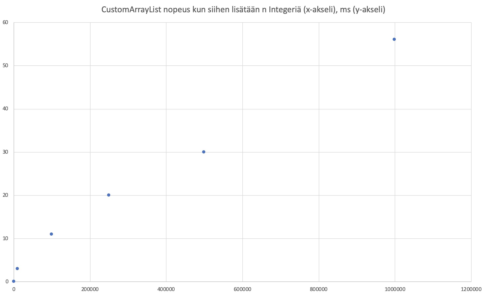

# Ohjelman yleisrakenne

Sovellusta on toteutettu MVC mallilla jossa pakkauksella `domain` on pitkälti model-rooli, `engine`-pakkauksella Controller-rooli ja `ui`-pakkauksella view-rooli. Sovellusarkkitehtuurissa on pidetty tiukasti kiinni riippuvuuksien injektoinnista testauksen helpottamiseksi. Single responsibility -periaatteesta on joustettu eikä rakenteessa ole esim. käytetty oliotehtaita vaikka se esim. World -luokan kohdalla olisi perusteltua. Metodien koheesiosta on kuitenkin pyritty pitämään huolta.

Keskeisimmät luokat esittelee [luokkakaavio](suunnittelu/luokkakaavio.pdf). Siinä kuvattujen pakkauksien lisäksi käytössä on `helpers`-pakkaus jossa on mm. projektiin toteutetut tietorakenteet. Luokkien ja niiden metodien tarkemmat kuvaukset löytyvät Javadoc -kuvauksista. Sovellusrakenteessa on haluttu pitää kiinni Eri luokkien orkestraatio sekä sen toteutus on kenties aavistuksen naivi sillä Java Swing ja sen stateless -malli on tekijälle varsin vieras. Luokkien yhteistoiminta on tarkemmin kuvattu sekvenssikaaviossa](suunnittelu/sekvenssikaavio.pdf).

Testaus noudattaa käytäntöä jossa testit on jaettu sovelluksen pakkauksia vastaaviin pakkauksiin ja luokkien testit luokkia vastaaviin testiluokkia. Esim. `domain/World`-luokan testit löytyvät siis `domain/WorldTest`-luokasta.

Riippuvuuksista merkittävin on [AsciiPanel](https://github.com/trystan/AsciiPanel) jota käytetään pelin piirtämiseen.


# Saavutetut aika- ja tilavaativuudet 

## Maailman luominen

Maailman luomisen algoritmi on yksinkertaistetusti:

````
funktio maailman luonti()
satunnainen häly
soluautomaatio(m)

funktio satunnainen häly()
    for (x<kartan leveys;x+1)
        for (y<kartan leveysys;y+1)
            kartta[x][y]=random(lattia,seinä)

funktio soluautomaatio(m)
    for (i<m;i+1)
        for (x<kartan leveys;x+1)
            for (y<kartan leveysys;y+1)
                käy läpi 8 ympäröivää ruutua ja laske lattiat sekä seinät
                if seinät > lattiat   
                    kartta[x][y]=seinä
                else
                    kartta[x][y]=lattia    
````

Pseudokoodista voidaan päätellä että kartan luomisen algoritmin tehokkuus on `m` * `n` jossa m on smooth -soluautomaatiometodin toistokerrat ja `n` kartan tiilien määrä. Satunnaisen hälyn vaativuus on vain `n` joten se lienee järkevintä jättää algoritmin tehokkuudessa mainitsematta. Koska `m` ei käytännössä nouse yli kymmenen lienee järkevintä sievistää kartan luomisen algoritmin tehokkuus muotoon O(n) jossa `n` on kartan tiilien määrä.

Päätelmää tukee että maailman luomisen mitattu esto on suoraan suhteessa kartain tiilien määrään 18 mittauksen keskiarvoilla laskettuna. 


Lisäksi maailman luomisen keston hajonta pysyttelee +-50% prosentin luokassa.


## Reitinhaku

````
// Initialize both open and closed list
let the openList equal empty list of nodes
let the closedList equal empty list of nodes

// Add the start node
put the startNode on the openList (leave it's f at zero)

// Loop until you find the end
while the openList is not empty

    // Get the current node
    let the currentNode equal the node with the least f value
    remove the currentNode from the openList
    add the currentNode to the closedList
    
    // Found the goal
    if currentNode is the goal
        Congratz! You've found the end! Backtrack to get path

    // Generate children
    let the children of the currentNode equal the adjacent nodes
    
    for each child in the children
        // Child is on the closedList
        if child is in the closedList
            continue to beginning of for loop

        // Create the f, g, and h values
        child.g = currentNode.g + distance between child and current
        child.h = distance from child to end
        child.f = child.g + child.h

        // Child is already in openList
        if child.position is in the openList's nodes positions
            if the child.g is higher than the openList node's g
                continue to beginning of for loop

        // Add the child to the openList
        add the child to the openList
````

A* algoritmin aikavaativuuksi on lähteissä mainittu O(b^d) `b`:n kuvatessa puun solmujen lapsien määrää (branching factor). Tarkastellessa mittaustuloksia kun A* heuristiikkana on matka^2 ja kartta vakioitu nähdään että reitin ja pinoon lisättyjen nodejen suhde pysyy hyvin vakaana joten voidaan päätellä että heuristiikka on optimaalinen reitinhaun verrattain yksinkertaiseen ongelmaan.


| Maailman koko       | Reitin pituus     | Nodeja lisätty pinoon    | Pinon maksimikoko    | Nodeja käsitelty | pituus / lisätty    |
|---------------------|------------------:| -------------------------:|---------------------:|-----------------:|--------------------:|--------------------:|
| 51x51               | 57                | 150                      | 89                   | 62                             | 0,38	               |
| 500x500             | 241               | 660                      | 418                  | 243                            | 0,37	               |
| 1000x1000           | 669               | 1848                     | 1093                 | 756                           | 0,36	               |
| 2001x2001           | 1122              | 3149                     | 1918                 | 1232                           | 0,36	               |
| 4001x4001           | 2082              | 5814                     | 3490                 | 2325                           | 0,36	               |


(Vakioidun ja sattumanvaraisesti luodun maailman mittaustulosten vastaavuus kuvattu [Testaus](testaus.md)-dokumentissa kappaleessa 'Reitinhaun käyttäytymisen testaus keon valinnan tueksi'.)

Näin ollen voidaan perustellusti väittää että reitinhakualgoritmin käytännön aikavaativuus käytössä olevalla kartan luomisen algoritmilla on O(n), jossa `n` on reitin pituus jos reitinhaun käyttämä keko suoriutuu add, poll ja isEmpty -metodeista ajassa O(1).


## Reitinhaun käyttämä PairingHeap

````

function insert(elem, heap)
  return merge(Heap(elem, []), heap)

function find-min(heap)
  if heap == Empty
    error
  else
    return heap.elem

function delete-min(heap)
  if heap == Empty
    error
  else
    return merge-pairs(heap.subheaps)

function merge(heap1, heap2)
  if heap1 == Empty
    return heap2
  elsif heap2 == Empty
    return heap1
  elsif heap1.elem < heap2.elem
    return Heap(heap1.elem, heap2 :: heap1.subheaps)
  else
    return Heap(heap2.elem, heap1 :: heap2.subheaps)

def twoPassPairing(x):
    #x is assumed to be a pointer to the first node of a list of tree roots
    #two pass pairing executes and combines trees into a single tree
    #returns a pointer to the root of result tree

````

Pseudokoodia tarkastelemalla voidaan päätellä että PairingHeap on  verrattain ripeä, O(log n) lähestyen O(1) kun siihen lisätään toinen toistaan pienempiä lukuja ja puu pysyy 'kapeana ja korkeana' ja verrattain hidas, lähelle O(log n) päinvastaisessa tilanteessa.

Reitinhaku toteutettiin kahteen kertaan, [ensimmäisen kerran naivisti](https://github.com/juhoaj/tiralabra-tractus/blob/7ad2b26149c4d214acd819b7a24d15e43653e77a/Tractus/src/main/java/helpers/PairingHeap.java) ja tämän jälkeen tehokkaammin. Ks. [Testaus](testaus.md).  

Kun tietorakenteisiin asetetaan n kpl. toistaan pienempiä tai suurempia Nodeja ja poistetaan n/2 kpl Nodea saadaan seuraavat mittaustulokset:



Tästä voidaan nähdä että toteutettu PairingHeapin paraskin mahdollinen suorituskyky on O(log n) mutta sen suorituskyky riippuu vahvasti siitä mihin sitä käytetään.

## CustomArrayList nopeus 

````

Olio[] array
int olioita

funktio lisää(olio)
    olioita++
    jos olioita > array.koko
        suurenna(array)
    array[olioita]=olio

funktio hae(i)
    palauta array[i]

funktio suurenna(array)
    Olio[array.koko*2] uusiArray;
    for i < array.koko
        uusiArray[i] = array[i]
    palauta uusiArray

````

Tästä voidaan päätellä että CustomArrayListin tehokkuus on pienimmillään O(1) jos arrayn kokoa ei tarvitse suurentaa mutta sen tehokkuus voi helposti tipahtaa O(n):ään.

Mittaustulokset tukevat päätelmää.




# Työn mahdolliset puutteet ja parannusehdotukset

Työn lähtökohtana on ollut "kuinka iso luolasto voidaan ja kuinka monta hirviötä siinä voi olla ennenkuin algoritmit kyykkäävät". 

Näin ollen maailman luomisessa voitaisiin käyttää myös proseduraalista maailman luomista jossa karttaa generoidaan pelaajan liikkeiden mukaan. Lisäksi hirviöt voisivat kauempana pelaajasta ollessaan käyttää vielä nopeampaa algoritmia, esim. vain kulkeutua pelaajan suuntaan. 

Field of view -algoritmia olisi myös ollut kiva harjoitella työssä mutta tämä rajattiin pois ajankäytön järkevyyden nimissä.

Jos harjoitustyötä tarkastellaan pelinä niin suuri osa tyypillisistä roguelike -elementeistä toki loistaa puuttumisellaan. 


# Lähteet
* [Nicholas Swift, Easy A* (star) Pathfinding](https://medium.com/@nicholas.w.swift/easy-a-star-pathfinding-7e6689c7f7b2)

* [Jakob Jenkov, Java Generics - Implementing the Iterable Interface](http://tutorials.jenkov.com/java-generics/implementing-iterable.html)

* [Wikipedia, Generics in Java](https://en.wikipedia.org/wiki/Generics_in_Java)

* [From Amit’s Thoughts on Pathfinding: Implementation notes](http://theory.stanford.edu/~amitp/GameProgramming/ImplementationNotes.html)

* [Karleigh Moore, Pairing Heap](https://brilliant.org/wiki/pairing-heap)

* [Wikipedia, Pairing Heap](https://en.wikipedia.org/wiki/Pairing_heap)

